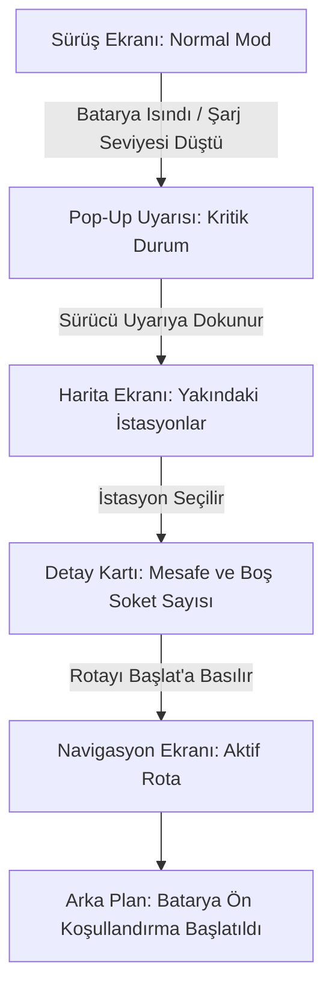

# 06_User_Workflow: Driver Experience & Screen Interaction

## Overview (Genel Bakış)

Bu doküman, EV-SmartCharge sisteminde elektrikli araç sürücüsünün ekran üzerindeki yolculuğunu ve sistemle gerçekleştirdiği adım adım etkileşimleri göstermektedir.

---

## Driver Interaction Diagram (Sürücü Ekran Akışı)

---

## Screen Flow Descriptions (Ekran Akış Açıklamaları)

### 1. Normal Sürüş Modu

Sürücü standart sürüş, navigasyon ve araç bilgilerini içeren ekranı görüntüler.

### 2. Kritik Uyarı Pop-Up'ı

Batarya sıcaklığı veya şarj seviyesi belirlenen kritik eşik değerine ulaştığında ekranda sesli ve görsel bir uyarı gösterilir.

### 3. Şarj İstasyonu Listesi

Sürücü uyarı ekranındaki istasyon arama seçeneğini kullandığında, konumuna göre belirlenen mesafe içerisindeki uygun şarj istasyonları harita üzerinde gösterilir.

### 4. İstasyon Seçimi ve Onay

Sürücü bir istasyon seçtiğinde istasyonun mesafesi, kullanılabilir soket sayısı ve bağlantı tipi gibi bilgiler gösterilir.

### 5. Navigasyon ve Batarya Ön Koşullandırma

Sürücü **"Rotayı Başlat"** seçeneğini onayladığında navigasyon yönlendirmesi başlatılır. Desteklenen araçlarda bataryanın şarja uygun sıcaklığa getirilmesi için ön koşullandırma süreci arka planda başlatılır.

---

## User Experience Summary

| Adım              | Kullanıcı Deneyimi                                 |
| ----------------- | -------------------------------------------------- |
| Normal sürüş      | Sürücü standart sürüş ekranını kullanır.           |
| Kritik durum      | Sistem sürücüyü sesli ve görsel olarak uyarır.     |
| İstasyon arama    | Sürücü yakındaki uygun istasyonları görüntüler.    |
| İstasyon seçimi   | Sürücü istasyon ve soket bilgilerini inceler.      |
| Rota başlatma     | Sürücü seçilen istasyona navigasyonu başlatır.     |
| Batarya hazırlığı | Desteklenen araçlarda ön koşullandırma başlatılır. |
