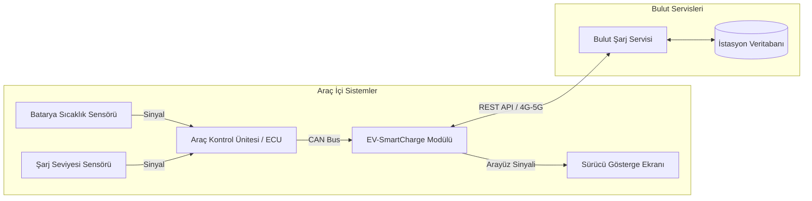

# 07_System_Architecture: Vehicle ECU & Cloud Integration

## Overview (Genel Bakış)

Bu doküman, EV-SmartCharge sisteminde araç içi bileşenler, sensörler, araç kontrol ünitesi (ECU), yazılım modülü ve bulut servisleri arasındaki temel mimari ilişkiyi göstermektedir.

---

## System Architecture Diagram (Sistem Mimari Şeması)

---

## Component Responsibilities (Bileşen Sorumlulukları)

### 1. Sensors (Sensörler)

Batarya sıcaklığı ve şarj seviyesi gibi araç durum bilgilerini ölçerek ilgili verileri araç kontrol ünitesine iletir.

### 2. ECU (Araç Kontrol Ünitesi)

Sensörlerden gelen verileri toplar ve araç içi haberleşme sistemi üzerinden ilgili yazılım modülüne aktarır.

### 3. EV-SmartCharge Module

Araçtan gelen verileri değerlendirir, tanımlanan iş kurallarına göre gerekli uyarıların oluşturulmasını sağlar ve bulut şarj servisi ile iletişim kurar.

### 4. HMI (Sürücü Gösterge Ekranı)

Sürücünün sistemle etkileşim kurduğu arayüzdür. Uyarılar, şarj istasyonu bilgileri ve navigasyon yönlendirmeleri bu arayüz üzerinden gösterilir.

### 5. Cloud Charging Service

Şarj istasyonlarının konum, uygunluk ve bağlantı tipi gibi bilgilerini sağlayan bulut tabanlı servistir.

### 6. Station Database

Şarj istasyonlarına ilişkin bilgilerin tutulduğu veri kaynağıdır. İstasyon kimliği, konum, kullanılabilir soket sayısı ve bağlantı tipi gibi bilgiler burada saklanabilir.

---

## Data Flow Summary (Veri Akışı Özeti)

Sistem içerisindeki temel veri akışı aşağıdaki şekildedir:

**Sensörler → ECU → EV-SmartCharge Modülü → HMI**

Şarj istasyonu arama sürecinde ise:

**EV-SmartCharge Modülü → REST API → Bulut Şarj Servisi → İstasyon Veritabanı**

Alınan istasyon bilgileri tekrar araç içerisindeki yazılım modülüne iletilerek sürücü ekranında görüntülenir.
